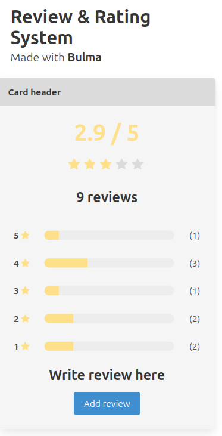
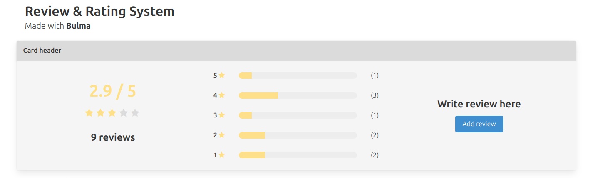

# Review & Rating System

This repository contains a web application for managing reviews and ratings. The application is built using **HTML, CSS (Bulma framework), JavaScript (jQuery), PHP, and MySQL**.

## Table of Contents
- [Review \& Rating System](#review--rating-system)
  - [Table of Contents](#table-of-contents)
  - [Introduction](#introduction)
  - [Features](#features)
  - [Pages](#pages)
  - [Technologies Used](#technologies-used)
  - [Installation](#installation)
  - [Usage](#usage)
  - [Screenshots](#screenshots)
    - [Mobile Version](#mobile-version)
    - [Desktop Version](#desktop-version)
  - [Contact](#contact)
  - [Credits](#credits)

## Introduction
The **Review & Rating System** is designed to provide an intuitive way for users to rate products/services and share feedback. This system dynamically updates review data, offering real-time interaction with a seamless user experience.

## Features
- **Dynamic Rating Display**: Users can view average ratings, total reviews, and rating distributions.
- **Interactive Rating System**: Users can submit ratings and reviews via a user-friendly modal interface.
- **AJAX-Based Requests**: The application leverages **AJAX** for real-time updates without requiring page reloads.
- **Responsive Design**: Built with **Bulma**, ensuring compatibility across multiple devices.
- **Secure Data Handling**: Review submissions are stored securely in a MySQL database.

## Pages
1. **Homepage**: Displays product/service ratings and reviews.
2. **Review Submission Modal**: Allows users to submit new ratings and feedback.

## Technologies Used
- **Frontend:** HTML, CSS (Bulma Framework), JavaScript (jQuery)
- **Backend:** PHP, MySQL
- **Database Management:** MySQL (with database schema `database.sql`)
- **Client-Server Interaction:** AJAX (for seamless interactions)

## Installation
1. Clone this repository to your local machine.
2. Set up a local development environment with PHP and MySQL.
3. Import the provided database schema (`database.sql`) to create the necessary database table.
4. Modify the **config.php** file to update database connection credentials (**ensure username and password are changed for security reasons**).
5. Start a PHP server and navigate to the project directory in your web browser.

## Usage
Once the application is running, users can:
- View average ratings, total reviews, and rating distribution.
- Submit reviews using the modal interface.
- Experience dynamic updates without page refreshes.

## Screenshots
Here are some previews of the system on different devices:

### Mobile Version

### Desktop Version

## Contact
For inquiries regarding this project, please reach out via email:
📩 contact@xiaodev.fr

## Credits
The Review & Rating System was created and maintained by **XiaoDev**.

---
If you have any questions or feedback, please [reach out](mailto:&#99;o&#110;&#116;%61%63t&#64;&#120;&#105;a&#111;&#100;%65%76%2e&#102;%72)..